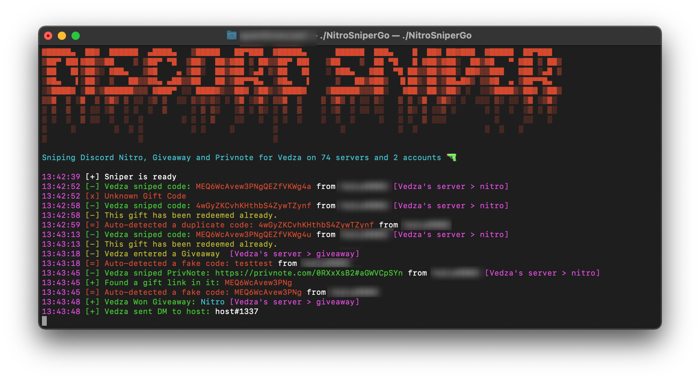

> # NitroSniperGo

[](https://github.com/vedza/NitroSniperGo/releases)
[](https://github.com/Vedza/NitroSniperGo)  
[](https://github.com/Vedzaa/NitroSniperGo/releases)
[](https://travis-ci.com/Vedza/NitroSniperGo)

<a href="https://www.buymeacoffee.com/Vedza" target="_blank"></a>

### New easy deploy with heroku [below](https://github.com/Vedza/NitroSniperGo#usage) 
<!-- [](https://heroku.com/deploy?template=https://github.com/Vedza/NitroSniperGo/tree/heroku)
<a href="https://repl.it/github/Vedza/NitroSniperGo" target="_blank"></a>-->

Discord Nitro sniper and Giveaway joiner in Go.



### ⚠️ I'm not working on it anymore. I will not add any features. Most of the suggestions and more are available in a paid version that is no longer being sold (Maybe it will be in the future). So be careful if someone claims he is selling the updated version, it's probably a scam or a malware.

#### Features

* Multiple accounts support to claim on one main account
* Optional Counter for max Nitro activations
* Optional main account sniper to only claim code from alts
* Cooldown for # hour(s) after redeeming # nitro code(s)
* Duplicate code detection
* Optional Giveaway joiner
* Words blacklist and whitelist to join or not giveaway
* DM host with custom message if giveaway won
* Optional Privnote sniper
* Optional custom status
* Optional Invite link sniper
* Optional Counter for max server joined
* Cooldown for # hour(s) after joining # server(s)
* Webhook support with good only mode that report only codes applied and giveaways won.
* Blacklist servers to not join any giveaways on these servers
* Blacklist servers to not snipe anything in it
* Custom delay to join giveaways, servers and DM giveaways host
* Print Nitro type when applied (Classic or Boost)
* Play sound when Nitro sniped (replace sound.mp3 to change the sound)

#### Usage

Edit `settings.json`

``` json5
{
  "tokens": {
    "main": "Nz...", // Main token
    "alts": [ // Alts token
      "Nz..."
    ]
  },
  "status": {
    "main": "", // online, offline, idle, dnd, invisible
    "alts": "invisible" // online, offline, idle, dnd, invisible
  },
  "nitro": {
    "max": 2,   // Max Nitro before cooldown
    "cooldown": 24,  // in Hour
    "main_sniper": true // Enable or not Nitro sniper on main account (It will only claim code from alts)
    "delay": true // Print or not redeem delay (useful to compare heroku/vps and your pc but hard to compare with other snipers for various reasons)
},
  "giveaway": {
    "enable": true, // Enable or not giveaway joiner
    "delay": 5, // Delay in second before joining giveaway
    "dm": "Hey, I won a giveaway !", // DM sent to giveaway host, leave empty to not send any dm
    "dm_delay": 10, // Delay in second before sending DM
    "blacklist_words": [ // Don't join giveaways with these words
      "test",
      "ban"
    ],
    "whitelist_words": [ // Only join giveaways with these words (put [] to join every giveaway)
      "nitro"
    ],
    "blacklist_servers": [ // IDs of servers you don't want the giveaway joiner to work on
      ""  
    ]
  },
  "invite": {
    "enable": true,
    "delay": {
      "min": 10, // Minimum delay in minute before joining server
      "max": 20  // Maximum delay in minute before joining server
    },
    "max": 10,    // Max Servers joined before cooldown
    "cooldown": 6 // in Hour
  },
  "privnote": {
    "enable": false // Enable or not Privnote sniper
  },
  "webhook": {
    "url": "",
    "good_only": false // Will trigger webhook only when you applied a Nitro code or won a giveaway
  },
  "blacklist_servers": [] // IDs of servers you don't want the sniper to work on

}
```

You have multiple choices to run the sniper :

- [Deploy on Heroku](https://heroku.com/) (Free 24/7)
    * Fork this repo
    * Go to https://dashboard.heroku.com/new?template=https://github.com/[YOUR-GITHUB-NICKNAME]/NitroSniperGo/tree/heroku
    * Deploy
    * Resources -> enable sniper
    * See logs in More -> View logs

- Download the latest [release](https://github.com/Vedza/NitroSniperGo/releases)

- Using Docker :

  - Linux & Powershell
     ``` sh
     docker run --rm --name NitroSniperGo -v ${pwd}/settings.json:/app/settings.json ghcr.io/vedza/nitrosnipergo:master
     # or 
     docker run --rm --name NitroSniperGo -v $PWD/settings.json:/app/settings.json ghcr.io/vedza/nitrosnipergo:master
     ```
  - Windows Command Line 
     ``` sh
     docker run --rm --name NitroSniperGo -v %cd%/settings.json:/app/settings.json ghcr.io/vedza/nitrosnipergo:master
     ```
- Compile it yourself
  ``` sh
  go mod download
  go build
  ./NitroSniperGo
  ```

 <!-- - [Deploy on Repl.it](https://repl.it/github/Vedza/NitroSniperGo) -->

#### How to obtain your token

https://github.com/Tyrrrz/DiscordChatExporter/wiki/Obtaining-Token-and-Channel-IDs#how-to-get-a-user-token

#### Known issues

* `error unmarshalling READY event` is not a problem, it just happens because you're doing a self bot
* `Already purchased` happens when the gift is a Xbox game pass plan, so if you already activated a discord game pass
  code you can't activate it anymore
* It looks like Discord added a security feature where your token change every time but also expire with 2FA, that might
  be the reason why the sniper doesn't work after some time or if you get an unauthorized error when sniping Nitro
* Some welcome bots mention giveaways that might cause a false positive
* Privnote sniper makes the program crash sometimes, disable it in settings if that happens to you until I find a
  solution

#### Disclaimer

This is against TOS and can get your account banned, especially if you run multiple instance at the same time and/or
claim too many Nitros in a too short amount of time. Use it at your own risks.

> *If you like my sniper consider putting a star on this repo !*
