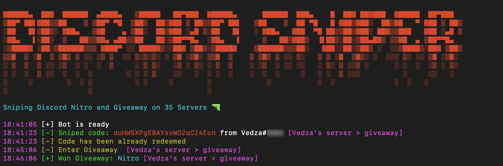

# NitroSniperGo

[](https://github.com/Vedzaa/NitroSniperGo/releases)
[](https://github.com/vedza/NitroSniperGo/releases)

Discord Nitro sniper and Giveaway joiner in Go.



Thanks for all the suggestions, but I probably won't add any unless someone wants to pay me
### Usage

Edit `settings.json`
```
{
  "token": "", // Your token here
  "nitro_max": 2, // Maxi Nitro before cooldown
  "cooldown": 24, // in Hour
  "giveaway_sniper": true // Enable or not giveaway joiner
  "nitro_giveaway_sniper": true, // Only join Nitro gieaways
  "giveaway_dm": "Hey, I won a giveaway !" // DM sent to giveaway host, leave empty to not send any dm
}
```

Compile it or download [release](https://github.com/Vedza/NitroSniperGo/releases)
```
 go mod download
 go build
 ./NitroSniperGo
 ```
 
### How to obtain your token
https://github.com/Tyrrrz/DiscordChatExporter/wiki/Obtaining-Token-and-Channel-IDs#how-to-get-a-user-token

### Disclaimer
This is against TOS and can get your account banned, especially if you run multiple instance at the same time and/or claim too much Nitros in a too short amount of time. Use it at your own risks.
